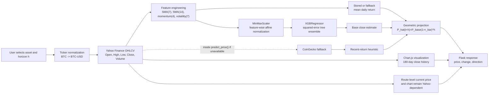

# Crypto Price Predictor: A Gradient-Boosted Baseline for Short-Horizon Cryptocurrency Price Projection

## Abstract

This repository implements a compact machine-learning system for cryptocurrency
price projection in a Flask web application. The implemented estimator combines
Yahoo Finance OHLCV observations, deterministic technical indicators, min-max
normalization, and an XGBoost regression model. Given a cryptoasset symbol and a
forecast horizon $h \in \{1,...,90\}$, the system estimates a conditional
price level from the latest engineered feature vector and then applies a
geometric trend adjustment based on a stored empirical daily return. Inside the
`predict_price()` routine, missing model/scaler state activates a lightweight
recent-return estimator; if that routine cannot retrieve Yahoo Finance data, it
can also fall back to CoinGecko for a small supported asset universe. The Flask
route still uses Yahoo Finance separately for the current-price display and the
historical chart.

The project is best understood as a reproducible educational baseline for
machine-learning research in high-volatility digital asset markets. It is not a
validated trading strategy. The current codebase does not implement a
chronological train/test split, walk-forward backtest, transaction-cost model,
position-sizing rule, or risk-adjusted portfolio evaluation. This README
therefore documents the mathematical object implemented by the repository, its
derivation, its assumptions, and its limitations in the style of a research
paper.

**Keywords:** cryptocurrency forecasting, XGBoost, gradient boosting, OHLCV,
technical indicators, time-series regression, geometric return projection,
quantitative finance.

## 1. Introduction

Cryptocurrency price prediction is a difficult non-stationary forecasting
problem. Prices are driven by market microstructure, liquidity cycles,
macroeconomic conditions, leverage, exchange-specific frictions, social
attention, protocol events, and regime shifts. In such an environment, a small
supervised learning system should be treated as a baseline estimator rather than
as evidence of exploitable alpha.

This repository operationalizes that baseline as a web application. A user
selects a cryptocurrency, chooses a forecast horizon, and receives a projected
USD price. The prediction path is:

1. fetch recent market observations,
2. construct deterministic price-history features,
3. normalize the features,
4. estimate a conditional close price with XGBoost when a trained model is
   available,
5. compound the stored or fallback empirical daily return over the requested
   horizon,
6. render the current price, projected price, percentage change, and historical
   price chart.

The method is deliberately lightweight: it avoids sequence models, order-book
features, news embeddings, and cross-asset factor models. Its scientific value
is in making the baseline explicit and auditable.

## 2. System Visualization

Figure 1 summarizes the implemented forecasting system.



**Figure 1.** Implemented data and prediction flow. Solid arrows denote the
primary Yahoo Finance and XGBoost path; dashed arrows denote the fallback path.

## 3. Repository Object of Study

The empirical object implemented by the repository is a supervised regression
pipeline.

| Component | Implementation |
| --- | --- |
| Application layer | Flask web app in `src/app.py` |
| User interface | Jinja/HTML template in `templates/index.html` |
| Primary data source | Yahoo Finance through `yfinance.download` |
| Fallback data source | CoinGecko public market-chart endpoint for selected symbols |
| Raw market variables | Open, High, Low, Close, Volume |
| Engineered variables | 7-day SMA, 14-day SMA, 4-day momentum, 7-day volatility |
| Scaling | `sklearn.preprocessing.MinMaxScaler` |
| Primary model | `xgboost.XGBRegressor(objective="reg:squarederror", n_estimators=150)` |
| Optional serialized model | `data/crypto_predictor.pkl` |
| Forecast horizon | User-selected integer, capped at 90 days |
| Visualization | 180-day historical close-price line chart via Chart.js |

The top-level `app.py` file is empty; the executable application entry point is
`src/app.py`.

## 4. Market Data and Notation

Let a cryptoasset be indexed by $a$, and let daily time be indexed by
$t=1,...,T$. The raw OHLCV observation is

$$
z_t^{(a)}
=
(O_t^{(a)}, H_t^{(a)}, L_t^{(a)}, C_t^{(a)}, V_t^{(a)}),
$$

where $O_t$ is open price, $H_t$ is high price, $L_t$ is low price,
$C_t$ is close price, and $V_t$ is traded volume. For readability, the asset
superscript is omitted below.

The repository trains on one year of daily data when `train_model()` is called:

$$
D_{365} = \{z_t\}_{t=1}^{365}.
$$

For web predictions, the model fetches recent data and constructs the same
feature map. Charting uses a separate 180-day close-price history.

## 5. Feature Engineering

The feature map $\phi_t$ transforms OHLCV observations into a numerical vector.
After feature construction, rows with missing rolling-window values are dropped.

### 5.1 Simple Moving Averages

For window length $k$, the simple moving average of close prices is

$$
SMA_k(t)
=
\frac{1}{k}
\sum_{i=0}^{k-1} C_{t-i}.
$$

The code uses two windows:

$$
SMA_7(t)
=
\frac{1}{7}
(C_t+C_{t-1}+...+C_{t-6}),
$$

$$
SMA_{14}(t)
=
\frac{1}{14}
(C_t+C_{t-1}+...+C_{t-13}).
$$

The short moving average captures faster local price level information, while
the 14-day average smooths over a longer local horizon. Their inclusion gives a
tree model access to level and trend-like comparisons, for example whether
$SMA_7(t) > SMA_{14}(t)$.

### 5.2 Momentum

The implemented 4-day momentum feature is the close-price difference

$$
M_4(t) = C_t - C_{t-4}.
$$

This is an additive momentum statistic. A positive value indicates that the
current close is above the close four observations earlier; a negative value
indicates short-window price deterioration. Unlike a return, this statistic is
not scale invariant:

$$
C_t - C_{t-4}
\neq
\frac{C_t-C_{t-4}}{C_{t-4}}.
$$

For assets with very different nominal price scales, this motivates the later
feature normalization step.

### 5.3 Rolling Volatility

The implemented 7-day volatility feature is the rolling sample standard
deviation of close prices:

$$
\sigma_7(t)
=
\sqrt{
\frac{1}{7-1}
\sum_{i=0}^{6}
(C_{t-i}-SMA_7(t))^2
}.
$$

This quantity measures local dispersion of prices around their 7-day mean. It is
a price-level volatility proxy rather than a return-volatility estimator. A
return-volatility estimator would instead use arithmetic returns

$$
r_t=\frac{C_t-C_{t-1}}{C_{t-1}}
$$

or log returns

$$
\ell_t=log C_t-log C_{t-1}.
$$

The implemented system uses the price-level version because it follows directly
from `data["Close"].rolling(7).std()`.

### 5.4 Complete Feature Vector

The model target is the close price $y_t=C_t$. The training feature vector is
$x_t = [O_t, H_t, L_t, V_t, SMA_7(t), SMA_{14}(t), M_4(t), \sigma_7(t)]^T$.

Equivalently, if $X \in R^{n \times p}$ is the design matrix after dropping
missing rows, then $p=8$, the rows of $X$ are $x_1^T,...,x_n^T$, and the target
vector is $y=[C_1,...,C_n]^T$.

Because the target is same-day close and the feature vector contains same-day
open, high, low, volume, and rolling features that include $C_t$, this is not
a pure next-day forecasting design. The repository then creates a future
projection by applying a geometric return adjustment to the model output.

## 6. Feature Scaling

The repository applies feature-wise min-max scaling before model fitting:

$$
\tilde{x}_{t,j}
=
\frac{x_{t,j}-m_j}{M_j-m_j},
$$

where

$$
m_j = min_{1\leq t\leq n} x_{t,j},
M_j = max_{1\leq t\leq n} x_{t,j}.
$$

Thus each transformed feature satisfies $\tilde{x}_{t,j}\in[0,1]$ when future
values remain within the training range. In vector form,

$$
\tilde{x}_t = S(x_t-m),
$$

where

$$
S=diag(
\frac{1}{M_1-m_1},...,\frac{1}{M_p-m_p}
).
$$

Tree ensembles do not generally require monotone feature scaling to find
threshold splits, but scaling is still useful here because it regularizes the
input representation, improves interoperability with serialized pipelines, and
makes the feature map easier to compare across variables with very different
units.

## 7. Supervised Learning Objective

The primary estimator is an XGBoost regression model. It represents the fitted
function as an additive ensemble of regression trees:

$$
\hat{f}_K(\tilde{x})
=
\sum_{k=1}^{K} f_k(\tilde{x}),
f_k \in F,
$$

where $F$ is the space of CART-style regression trees. Each tree maps
an input vector to a leaf weight:

$$
f_k(\tilde{x}) = w_{q_k(\tilde{x})},
$$

where $q_k(\cdot)$ assigns the observation to a leaf and $w$ is the vector of
leaf scores.

The repository configures squared-error regression. For observed target $y_i$,
the prediction after $K$ trees is $\hat{y}_i^{(K)}$, and the empirical
squared-error loss is

$$
L(\theta)
=
\sum_{i=1}^{n}
(y_i-\hat{y}_i)^2.
$$

XGBoost augments empirical loss with tree complexity penalties. A common
regularized objective for tree $f$ is

$$
Obj
=
\sum_{i=1}^{n} l(y_i,\hat{y}_i)
+
\sum_{k=1}^{K} \Omega(f_k),
$$

with

$$
\Omega(f)
=
\gamma T_f
+
\frac{\lambda}{2}\sum_{j=1}^{T_f} w_j^2,
$$

where $T_f$ is the number of leaves, $w_j$ is the score of leaf $j$,
$\gamma$ penalizes adding leaves, and $\lambda$ penalizes large leaf weights.

## 8. Derivation of the XGBoost Tree Update

At boosting iteration $k$, the model has prediction

$$
\hat{y}_i^{(k-1)}
=
\sum_{s=1}^{k-1} f_s(\tilde{x}_i).
$$

The next tree $f_k$ is chosen to minimize

$$
Obj^{(k)}
=
\sum_{i=1}^{n}
l(y_i,\hat{y}_i^{(k-1)}+f_k(\tilde{x}_i))
+
\Omega(f_k).
$$

Using a second-order Taylor approximation around $\hat{y}_i^{(k-1)}$,

$$
l(y_i,\hat{y}_i^{(k-1)}+f_k(\tilde{x}_i))
\approx
l(y_i,\hat{y}_i^{(k-1)})
+
g_i f_k(\tilde{x}_i)
+
\frac{1}{2} h_i f_k(\tilde{x}_i)^2,
$$

where

$$
g_i =
\frac{\partial l(y_i,\hat{y})}{\partial \hat{y}}
|_{\hat{y}=\hat{y}_i^{(k-1)}},
h_i =
\frac{\partial^2 l(y_i,\hat{y})}{\partial \hat{y}^2}
|_{\hat{y}=\hat{y}_i^{(k-1)}}.
$$

For squared error

$$
l(y_i,\hat{y}_i)=(y_i-\hat{y}_i)^2,
$$

the derivatives are

$$
g_i = 2(\hat{y}_i^{(k-1)}-y_i),
h_i = 2.
$$

Ignoring the constant term independent of $f_k$, the approximate objective is

$$
\widetilde{Obj}^{(k)}
=
\sum_{i=1}^{n}
[
g_i f_k(\tilde{x}_i)
+
\frac{1}{2}h_i f_k(\tilde{x}_i)^2
]
+
\gamma T
+
\frac{\lambda}{2}\sum_{j=1}^{T}w_j^2.
$$

Let $I_j=\{i:q(\tilde{x}_i)=j\}$ be the observations assigned to leaf $j$.
Since $f_k(\tilde{x}_i)=w_j$ for $i\in I_j$, define the aggregated first and
second derivatives

$$
G_j=\sum_{i\in I_j}g_i,
H_j=\sum_{i\in I_j}h_i.
$$

Then the objective decomposes by leaf:

$$
\widetilde{Obj}^{(k)}
=
\sum_{j=1}^{T}
[
G_jw_j
+
\frac{1}{2}(H_j+\lambda)w_j^2
]
+
\gamma T.
$$

The optimal leaf weight is obtained by differentiating with respect to $w_j$:

$$
\frac{\partial \widetilde{Obj}^{(k)}}{\partial w_j}
=
G_j+(H_j+\lambda)w_j.
$$

Setting the derivative to zero gives

$$
w_j^\star
=
-
\frac{G_j}{H_j+\lambda}.
$$

Substituting this optimum into the objective gives the score of a tree structure:

$$
\widetilde{Obj}^{(k)}(q)
=
-
\frac{1}{2}
\sum_{j=1}^{T}
\frac{G_j^2}{H_j+\lambda}
+
\gamma T.
$$

For a proposed split of a node into left and right children, the split gain is

$$
Gain
=
\frac{1}{2}
[
\frac{G_L^2}{H_L+\lambda}
+
\frac{G_R^2}{H_R+\lambda}
-
\frac{(G_L+G_R)^2}{H_L+H_R+\lambda}
]
-
\gamma.
$$

A split is attractive when it sufficiently reduces the approximate regularized
loss. This is the mechanism by which XGBoost learns nonlinear interactions among
raw OHLCV variables, moving averages, momentum, and volatility.

## 9. Forecast Construction

The trained model produces a base estimate from the latest feature vector:

$$
\hat{C}_{t,base}
=
\hat{f}_K(\tilde{x}_t).
$$

The full model path then compounds this base estimate by the object's stored
daily arithmetic return. That value is assigned during `train_model()` or loaded
from `data/crypto_predictor.pkl` when the artifact provides a `daily_return`
field. In training, the daily return is estimated as

$$
\bar{r}
=
\frac{1}{n-1}
\sum_{s=2}^{n}
\frac{C_s-C_{s-1}}{C_{s-1}}.
$$

If a compatible model and scaler are loaded without a stored daily return, the
default value is $\bar{r}=0$, so the geometric adjustment is neutral.

For a requested horizon $h$, the final projected price is

$$
\hat{C}_{t+h}
=
\hat{C}_{t,base}(1+\bar{r})^h.
$$

This formula follows from recursively applying a constant expected daily return:

$$
\hat{C}_{t+1}=\hat{C}_{t,base}(1+\bar{r}),
$$

$$
\hat{C}_{t+2}
=
\hat{C}_{t+1}(1+\bar{r})
=
\hat{C}_{t,base}(1+\bar{r})^2,
$$

and, by induction,

$$
\hat{C}_{t+h}
=
\hat{C}_{t,base}(1+\bar{r})^h.
$$

The reported projected change is

$$
\Delta_h
=
\frac{\hat{C}_{t+h}-C_t}{C_t}\times 100\%.
$$

The UI marks the prediction as upward when $\hat{C}_{t+h}>C_t$ and downward
otherwise.

## 10. Fallback Estimator

If the primary model or scaler is missing, the repository uses a reduced
estimator. It computes recent consecutive returns from available close prices,
takes the mean of the last seven returns when possible, and projects the current
close geometrically:

$$
\bar{r}_{7}
=
\frac{1}{m}
\sum_{j=1}^{m} r_{n-j+1},
m=min(7,n-1),
$$

$$
\hat{C}_{t+h}^{fallback}
=
C_t(1+\bar{r}_{7})^h.
$$

Inside `predict_price()`, the CoinGecko fallback maps a small set of common
symbols to asset identifiers: BTC, ETH, XRP, SOL, LTC, and DOGE. This path avoids
the heavier machine-learning dependencies but is correspondingly less expressive.
It does not replace the route-level Yahoo Finance calls used for the displayed
current price and chart.

## 11. Algorithmic Summary

```text
Input:
    crypto symbol a
    horizon h <= 90

Primary path:
    1. Convert symbol to Yahoo Finance ticker, e.g. BTC -> BTC-USD.
    2. Download OHLCV observations.
    3. Construct SMA_7, SMA_14, 4-day momentum, and 7-day volatility.
    4. Drop rows with missing rolling-window values.
    5. If a model and scaler exist:
         a. Scale the latest feature row.
         b. Predict base close using XGBRegressor.
         c. Read stored daily_return from training, artifact loading, or default state.
         d. Project base close by (1 + daily_return)^h.
    6. If model/scaler do not exist:
         a. Compute recent daily returns.
         b. Project current close by (1 + recent mean return)^h.
    7. Display current price, projected price, percentage change, and direction.

Chart path:
    1. Download 180 days of close prices.
    2. Render a Chart.js line plot in the browser.

Route-level note:
    The current price display and chart request Yahoo Finance data directly.
    Therefore, the CoinGecko fallback is a prediction-routine fallback, not a
    complete replacement for every web-route data dependency.
```

## 12. Research Interpretation

The implemented estimator can be interpreted as a hybrid of conditional
regression and deterministic trend extrapolation:

$$
\hat{C}_{t+h}
=
g_{trend}
(
g_{ML}(\phi(z_t))
),
$$

where

$$
g_{ML}(\phi(z_t))=\hat{f}_K(\tilde{x}_t)
$$

and

$$
g_{trend}(u)=u(1+\bar{r})^h.
$$

This decomposition is useful because it separates two assumptions:

1. the feature vector contains enough information to estimate a local close-price
   level, and
2. the stored or fallback mean return is a reasonable short-horizon extrapolator.

Both assumptions are strong in cryptocurrency markets. Price distributions are
heavy-tailed, volatility clusters over time, and structural breaks are common.
Therefore, the implemented method is more defensible as a baseline for research
comparison than as a standalone market model.

## 13. Limitations and Threats to Validity

### 13.1 Same-Day Target Construction

The training target is $C_t$, and the feature vector includes quantities
computed using day $t$, including $H_t$, $L_t$, $V_t$, and rolling
statistics containing $C_t$. For strict next-day forecasting, the target would
typically be shifted:

$$
y_t^{next} = C_{t+1}
$$

or

$$
y_t^{return} = r_{t+1}.
$$

The current repository does not apply that shift. As a result, the XGBoost
component should be read as a same-period price-level regression used inside a
projection rule.

### 13.2 No Backtesting Protocol

The repository does not currently implement:

- chronological train/validation/test splitting,
- expanding-window or rolling-window backtests,
- prediction-interval estimation,
- benchmark comparison against random walk or buy-and-hold,
- transaction costs, slippage, or liquidity constraints,
- statistical significance tests such as Diebold-Mariano comparisons.

A paper-grade empirical study would require such a protocol before making
claims about predictive performance.

### 13.3 Non-Stationarity

The conditional distribution

$$
P(C_{t+h}\mid x_t)
$$

is unlikely to be stable over long periods. Cryptoasset regimes can change after
exchange failures, ETF flows, monetary-policy shifts, protocol upgrades,
regulatory events, and leverage liquidations. A model trained on the past year
may not remain calibrated in a new regime.

### 13.4 Point Forecast Only

The application returns a point forecast. It does not estimate predictive
uncertainty:

$$
\hat{C}_{t+h}
$$

without interval estimates such as

$$
[
q_{\alpha/2}(C_{t+h}\mid x_t),
q_{1-\alpha/2}(C_{t+h}\mid x_t)
].
$$

For financial decision-making, intervals, drawdown estimates, and tail-risk
metrics are generally more informative than isolated point estimates.

## 14. Reproducibility

### 14.1 Installation

```bash
python3 -m venv venv
source venv/bin/activate
pip install -r requirements.txt
```

### 14.2 Running the Application

```bash
python src/app.py
```

The Flask server runs on:

```text
http://127.0.0.1:8000
```

### 14.3 Supported Web Inputs

The UI exposes BTC, ETH, SOL, XRP, LTC, and DOGE. The backend also accepts
symbols that can be normalized into Yahoo Finance tickers such as `BTC-USD`.
The forecast horizon is capped at 90 days.

### 14.4 Model Artifact

At startup, the application attempts to load:

```text
data/crypto_predictor.pkl
```

The file may contain a model object directly or a dictionary with keys such as
`model`, `scaler`, and `daily_return`. If no usable model/scaler is loaded, the
application uses the fallback return-projection path.

In the current repository state, predictions should be interpreted with this
loader contract in mind: a serialized object that does not provide both a usable
model and a compatible scaler will not activate the full normalized XGBoost
path. The live system then behaves as the recent-return projection estimator
described in Section 10.

## 15. Suggested Extensions for a Research-Grade Study

The next research iteration should convert this baseline into a falsifiable
forecasting experiment:

1. define the target as next-day return or $h$-day forward return,
2. shift all features so only information available at decision time is used,
3. add walk-forward validation,
4. compare against random walk, moving-average, ARIMA, and naive momentum
   baselines,
5. evaluate MAE, RMSE, MAPE, directional accuracy, calibration, Sharpe ratio,
   maximum drawdown, and turnover,
6. estimate uncertainty with quantile regression, conformal prediction, or
   bootstrap ensembles,
7. include transaction costs and liquidity assumptions,
8. report results by market regime.

## 16. Ethics, Safety, and Financial Disclaimer

This repository is for educational and research purposes only. It does not
provide financial advice, investment advice, or a trading recommendation.
Cryptocurrency markets are volatile and can produce large losses. Any empirical
claim about profitability would require out-of-sample validation, transaction
cost modeling, and risk analysis that are not currently implemented in this
repository.

## 17. License

This project is protected under the MIT License.

## References

1. T. Chen and C. Guestrin, "XGBoost: A Scalable Tree Boosting System," 2016.
2. J. H. Friedman, "Greedy Function Approximation: A Gradient Boosting Machine,"
   2001.
3. L. Breiman, J. Friedman, R. Olshen, and C. Stone, *Classification and
   Regression Trees*, 1984.
