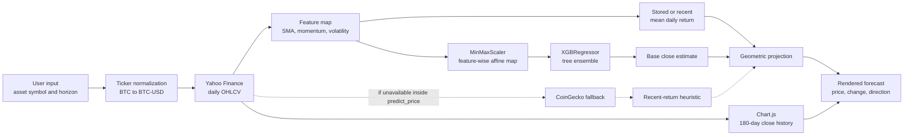
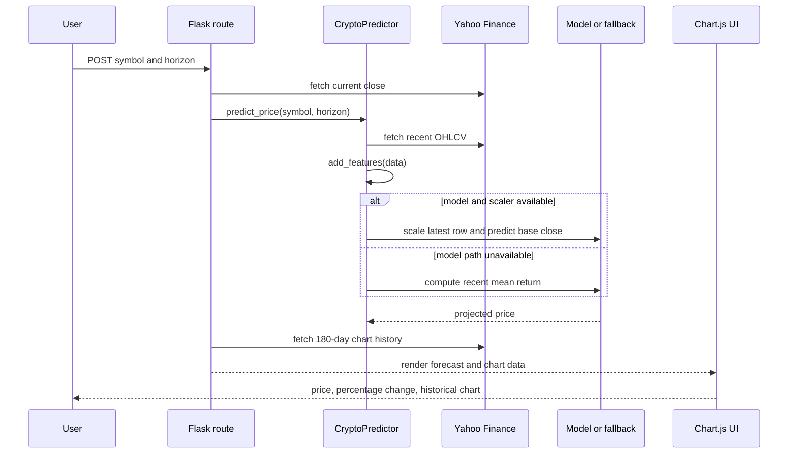

# Crypto Price Predictor

## A Research-Paper Style Documentation of a Lightweight Cryptocurrency Forecasting Baseline

### Abstract

This repository implements a compact cryptocurrency price-projection system
served through a Flask web application. The implemented pipeline collects daily
OHLCV data from Yahoo Finance, constructs deterministic technical indicators,
normalizes the resulting feature matrix with min-max scaling, and applies an
XGBoost regression model when a compatible serialized model and scaler are
available. If the trained model path is unavailable, the application falls back
to a recent-return heuristic that compounds the current price by the mean of the
latest observed daily returns.

**Keywords:** cryptocurrency forecasting, OHLCV data, XGBoost, gradient
boosting, technical indicators, min-max scaling, time-series regression, Flask,
Yahoo Finance, financial machine learning.

## Navigation

| Paper Area | Direct Links |
| --- | --- |
| Setup and scope | [Abstract](#abstract), [Introduction](#1-introduction), [Contributions](#2-contributions), [System Overview](#3-system-overview) |
| Visual material | [Visual Demonstration](#4-visual-demonstration), [End-to-End Data Flow](#41-end-to-end-data-flow), [Request and Response Sequence](#42-request-and-response-sequence), [Forecast Geometry](#43-conceptual-forecast-geometry) |
| Mathematical formulation | [Market Data and Notation](#5-market-data-and-notation), [Feature Map](#6-feature-map), [Normalization](#7-normalization), [Primary Estimator](#8-primary-estimator), [Boosting Derivation](#9-boosting-derivation) |
| Forecasting mechanics | [Forecast Construction](#10-forecast-construction), [Fallback Estimator](#11-fallback-estimator), [Algorithm](#12-algorithm), [Statistical Interpretation](#13-statistical-interpretation) |
| Research limits and usage | [Validity Threats](#14-validity-threats), [Research-Grade Extension Plan](#15-research-grade-extension-plan), [Reproducibility](#16-reproducibility), [File Map](#17-file-map), [Safety and Ethics](#18-safety-and-ethics) |

For a fast technical read, start with the [system overview](#3-system-overview),
then move through the [feature map](#6-feature-map),
[normalization step](#7-normalization), [boosting derivation](#9-boosting-derivation), and
[forecast construction](#10-forecast-construction). For a critical review of
the model assumptions, jump directly to [validity threats](#14-validity-threats).

## 1. Introduction

Cryptocurrency forecasting is a non-stationary time-series problem with
heavy-tailed returns, volatility clustering, liquidity fragmentation, regime
changes, and exogenous shocks. A practical baseline model should therefore be
judged by whether its assumptions are explicit and testable, not by whether it
produces a visually plausible point forecast.

This repository implements such a baseline. A user selects an asset symbol and a
forecast horizon, and the Flask application returns a projected USD price, a
percentage change, and a historical price chart. The core prediction routine can
be summarized as:

1. transform a crypto symbol into a Yahoo Finance ticker,
2. download recent OHLCV observations,
3. construct moving-average, momentum, and volatility features,
4. scale the feature vector,
5. estimate a same-period close-price level with XGBoost when a trained model is
   available,
6. project the estimated level forward by compounding an empirical daily return,
7. fall back to a recent-return heuristic when the model or scaler is missing.

The system is intentionally small. It does not use order-book depth, exchange
flows, market sentiment, macro features, cross-asset factors, sequence models, or
probabilistic intervals. This constraint makes the method auditable: every
transformation can be written down and inspected.

## 2. Contributions

This repository contributes:

- a runnable Flask interface for cryptocurrency price projection,
- an explicit feature map built from OHLCV observations,
- an XGBoost-based regression baseline with a serialized-model loading path,
- a dependency-light fallback estimator based on recent arithmetic returns,
- an in-browser Chart.js visualization of 180 days of historical prices,
- a documented research protocol for turning the baseline into a falsifiable
  forecasting experiment.


## 3. System Overview

The executable application is implemented in `src/app.py`. The root-level
`app.py` is empty in the current repository state. The user interface is defined
in `templates/index.html`.

This section is the implementation counterpart to the mathematical
[feature map](#6-feature-map), [normalization](#7-normalization), and
[forecast construction](#10-forecast-construction) sections.

| Layer | Implementation |
| --- | --- |
| Web framework | Flask |
| UI template | Jinja-compatible HTML template |
| Primary market data source | `yfinance.download` |
| Fallback market data source | CoinGecko market-chart endpoint for selected symbols |
| Training window | 365 daily observations when `train_model()` is invoked |
| Prediction data window | 30 daily observations inside `predict_price()` |
| Chart window | 180 daily observations |
| Engineered features | `SMA_7`, `SMA_14`, `Momentum`, `Volatility` |
| Normalizer | `sklearn.preprocessing.MinMaxScaler` |
| Primary estimator | `xgboost.XGBRegressor` |
| Serialized artifact path | `data/crypto_predictor.pkl` |
| Forecast horizon | integer horizon capped at 90 days |

## 4. Visual Demonstration

The diagrams below provide a visual route into the formal model. Use
[Figure 1](#41-end-to-end-data-flow) for the data pipeline,
[Figure 2](#42-request-and-response-sequence) for the web request lifecycle, and
[Figure 3](#43-conceptual-forecast-geometry) for the geometric projection
sensitivity.

### 4.1 End-to-End Data Flow



**Figure 1.** Runtime path for the application. Solid arrows denote the primary
Yahoo Finance and model path. Dashed arrows denote the fallback path used inside
the prediction routine.

### 4.2 Request and Response Sequence



**Figure 2.** Web request lifecycle from form submission to rendered forecast.

### 4.3 Conceptual Forecast Geometry

The final forecast is the product of a local price-level estimate and a
geometric trend adjustment. Holding the base estimate fixed, the horizon
projection behaves as follows:

| Mean daily return | 7-day multiplier | 30-day multiplier | Interpretation |
| ---: | ---: | ---: | --- |
| `-2.0%` | `0.8681` | `0.5455` | strong negative drift assumption |
| `-0.5%` | `0.9655` | `0.8604` | mild negative drift assumption |
| `0.0%` | `1.0000` | `1.0000` | neutral trend assumption |
| `0.5%` | `1.0355` | `1.1614` | mild positive drift assumption |
| `2.0%` | `1.1487` | `1.8114` | strong positive drift assumption |

**Figure 3.** Sensitivity of the geometric projection term. The implemented
model is highly sensitive to the empirical daily return when the requested
horizon grows.

## 5. Market Data and Notation

This notation supports the later derivations in the [feature map](#6-feature-map),
[primary estimator](#8-primary-estimator), and [forecast construction](#10-forecast-construction).

Let asset identity be indexed by $a$, and let daily time be indexed by
$t = 1,\ldots,T$. The raw market observation is

```math
z_t^{(a)}
=
\left(
O_t^{(a)},
H_t^{(a)},
L_t^{(a)},
C_t^{(a)},
V_t^{(a)}
\right),
```

where $O_t$ is open price, $H_t$ is high price, $L_t$ is low price,
$C_t$ is close price, and $V_t$ is volume. For readability, the asset
superscript is omitted in later equations.

The observed historical sample is

```math
\mathcal{D}_T = \{z_t\}_{t=1}^{T}.
```

When `train_model()` is called, the repository requests one year of daily
observations:

```math
T_{\mathrm{train}} = 365.
```

At prediction time, the repository requests a shorter recent window:

```math
T_{\mathrm{predict}} = 30.
```

The charting path separately requests:

```math
T_{\mathrm{chart}} = 180.
```

## 6. Feature Map

The feature map is the bridge between raw OHLCV observations in
[Section 5](#5-market-data-and-notation) and the scaled model input in
[Section 7](#7-normalization).

The repository transforms each OHLCV row into an eight-dimensional supervised
learning feature vector after dropping rows with missing rolling-window values.

### 6.1 Simple Moving Averages

For a rolling window $k$, the simple moving average is

```math
\mathrm{SMA}_k(t)
=
\frac{1}{k}
\sum_{i=0}^{k-1} C_{t-i}.
```

The implemented windows are $k=7$ and $k=14$:

```math
\mathrm{SMA}_7(t)
=
\frac{1}{7}
\sum_{i=0}^{6} C_{t-i},
```

```math
\mathrm{SMA}_{14}(t)
=
\frac{1}{14}
\sum_{i=0}^{13} C_{t-i}.
```

The moving averages expose local price-level structure. A tree model can then
learn nonlinear conditions such as whether short-run price level exceeds
longer-run price level:

```math
\mathrm{SMA}_7(t) > \mathrm{SMA}_{14}(t).
```

### 6.2 Momentum

The implemented momentum feature is a four-day close-price difference:

```math
M_4(t) = C_t - C_{t-4}.
```

This is additive momentum, not percentage momentum. The scale-dependent nature
is important:

```math
C_t - C_{t-4}
\neq
\frac{C_t - C_{t-4}}{C_{t-4}}.
```

For assets with different nominal price levels, this motivates explicit feature
normalization.

### 6.3 Rolling Volatility

The code uses a seven-day rolling sample standard deviation of close prices:

```math
\sigma_7(t)
=
\sqrt{
\frac{1}{7-1}
\sum_{i=0}^{6}
\left(C_{t-i} - \mathrm{SMA}_7(t)\right)^2
}.
```

This is a price-level volatility proxy. A return-volatility estimator would use
arithmetic returns

```math
r_t = \frac{C_t - C_{t-1}}{C_{t-1}}
```

or log returns

```math
\ell_t = \log C_t - \log C_{t-1}.
```

The implemented repository uses price-level dispersion because it follows
directly from `data["Close"].rolling(7).std()`.

### 6.4 Complete Feature Vector

After feature construction, the model target is the same-day close:

```math
y_t = C_t.
```

The feature vector is

```math
x_t =
\left[
O_t,\,
H_t,\,
L_t,\,
V_t,\,
\mathrm{SMA}_7(t),\,
\mathrm{SMA}_{14}(t),\,
M_4(t),\,
\sigma_7(t)
\right]^\top.
```

Let $p=8$ be the feature dimension. The design matrix is

```math
X =
\begin{bmatrix}
x_1^\top \\
x_2^\top \\
\vdots \\
x_n^\top
\end{bmatrix}
\in \mathbb{R}^{n \times p},
\qquad
y =
\begin{bmatrix}
C_1 \\
C_2 \\
\vdots \\
C_n
\end{bmatrix}.
```

The use of same-day high, low, volume, and rolling statistics containing
$C_t$ means the trained model is not a strict next-day forecasting model. It
is a same-period close-level regression that is later pushed forward by a
geometric trend rule.

## 7. Normalization

This section transforms the feature vector from [Section 6](#6-feature-map)
into the scaled input consumed by the [primary estimator](#8-primary-estimator).

The repository applies min-max scaling to the feature matrix before fitting the
XGBoost model. For feature $j$, define

```math
m_j = \min_{1 \leq i \leq n} X_{i,j},
\qquad
M_j = \max_{1 \leq i \leq n} X_{i,j}.
```

The scaled feature is

```math
\widetilde{X}_{i,j}
=
\frac{X_{i,j} - m_j}{M_j - m_j}.
```

In vector form, the transformation can be written as

```math
\widetilde{x}_i
=
D^{-1}(x_i - m),
```

where

```math
D =
\mathrm{diag}
\left(
M_1-m_1,\,
M_2-m_2,\,
\ldots,\,
M_p-m_p
\right).
```

If future values remain inside the observed training range, each scaled feature
lies in the interval $[0,1]$. If future values exceed the training extrema,
min-max scaling can produce values below 0 or above 1:

```math
x_{*,j} > M_j
\quad \Rightarrow \quad
\widetilde{x}_{*,j} > 1.
```

This matters in cryptocurrency markets because new highs, new lows, and volume
regime changes are common.

## 8. Primary Estimator

The estimator uses the scaled feature representation from
[Section 7](#7-normalization). Its tree-update mechanics are derived in
[Section 9](#9-boosting-derivation).

The primary estimator is `XGBRegressor` configured with squared-error
regression and 150 boosting rounds:

```python
XGBRegressor(objective="reg:squarederror", n_estimators=150)
```

The model represents the prediction function as an additive ensemble of
regression trees:

```math
\widehat{f}_K(\widetilde{x})
=
\sum_{k=1}^{K} f_k(\widetilde{x}),
\qquad
f_k \in \mathcal{F}.
```

Each tree maps an input vector to a leaf score:

```math
f_k(\widetilde{x}) = w_{q_k(\widetilde{x})},
```

where $q_k(\cdot)$ assigns the observation to a leaf and $w$ contains the
leaf weights.

The empirical squared-error loss is

```math
\mathcal{L}
=
\sum_{i=1}^{n}
\left(y_i - \widehat{y}_i\right)^2.
```

XGBoost uses a regularized objective of the form

```math
\mathrm{Obj}
=
\sum_{i=1}^{n}
l(y_i,\widehat{y}_i)
+
\sum_{k=1}^{K}\Omega(f_k),
```

with tree complexity penalty

```math
\Omega(f)
=
\gamma T_f
+
\frac{\lambda}{2}
\sum_{j=1}^{T_f}w_j^2.
```

Here $T_f$ is the number of leaves in tree $f$, $w_j$ is the score in leaf
$j$, $\gamma$ penalizes additional leaves, and $\lambda$ penalizes large
leaf weights.

## 9. Boosting Derivation

This derivation explains the optimization mechanism behind the
[primary estimator](#8-primary-estimator). The output of this estimator becomes
the base price used in [forecast construction](#10-forecast-construction).

At boosting iteration $k$, the prediction before adding the new tree is

```math
\widehat{y}_i^{(k-1)}
=
\sum_{s=1}^{k-1} f_s(\widetilde{x}_i).
```

The next tree is chosen to minimize

```math
\mathrm{Obj}^{(k)}
=
\sum_{i=1}^{n}
l\left(
y_i,
\widehat{y}_i^{(k-1)} + f_k(\widetilde{x}_i)
\right)
+
\Omega(f_k).
```

Using a second-order Taylor approximation around
$\widehat{y}_i^{(k-1)}$,

```math
l\left(
y_i,
\widehat{y}_i^{(k-1)} + f_k(\widetilde{x}_i)
\right)
\approx
l\left(y_i,\widehat{y}_i^{(k-1)}\right)
+
g_i f_k(\widetilde{x}_i)
+
\frac{1}{2}h_i f_k(\widetilde{x}_i)^2,
```

where

```math
g_i =
\frac{\partial l(y_i,\widehat{y})}{\partial \widehat{y}}
\bigg|_{\widehat{y}=\widehat{y}_i^{(k-1)}},
\qquad
h_i =
\frac{\partial^2 l(y_i,\widehat{y})}{\partial \widehat{y}^2}
\bigg|_{\widehat{y}=\widehat{y}_i^{(k-1)}}.
```

For squared error,

```math
l(y_i,\widehat{y}_i)
=
\left(y_i-\widehat{y}_i\right)^2,
```

so the derivatives are

```math
g_i = 2\left(\widehat{y}_i^{(k-1)}-y_i\right),
\qquad
h_i = 2.
```

Ignoring constants independent of the new tree gives

```math
\widetilde{\mathrm{Obj}}^{(k)}
=
\sum_{i=1}^{n}
\left[
g_i f_k(\widetilde{x}_i)
+
\frac{1}{2}h_i f_k(\widetilde{x}_i)^2
\right]
+
\gamma T
+
\frac{\lambda}{2}
\sum_{j=1}^{T}w_j^2.
```

Let

```math
I_j = \{i : q(\widetilde{x}_i)=j\}
```

be the observations assigned to leaf $j$. Define the leaf-level gradient and
Hessian sums:

```math
G_j = \sum_{i \in I_j} g_i,
\qquad
H_j = \sum_{i \in I_j} h_i.
```

Because $f_k(\widetilde{x}_i)=w_j$ for observations in leaf $j$, the
objective decomposes by leaf:

```math
\widetilde{\mathrm{Obj}}^{(k)}
=
\sum_{j=1}^{T}
\left[
G_jw_j
+
\frac{1}{2}(H_j+\lambda)w_j^2
\right]
+
\gamma T.
```

Differentiating with respect to $w_j$ gives

```math
\frac{\partial \widetilde{\mathrm{Obj}}^{(k)}}{\partial w_j}
=
G_j + (H_j+\lambda)w_j.
```

Setting the derivative equal to zero yields the optimal leaf weight:

```math
w_j^\star
=
-
\frac{G_j}{H_j+\lambda}.
```

Substituting $w_j^\star$ into the objective gives the score for a fixed tree
structure:

```math
\widetilde{\mathrm{Obj}}^{(k)}(q)
=
-
\frac{1}{2}
\sum_{j=1}^{T}
\frac{G_j^2}{H_j+\lambda}
+
\gamma T.
```

For a candidate split into left and right children, the split gain is

```math
\mathrm{Gain}
=
\frac{1}{2}
\left[
\frac{G_L^2}{H_L+\lambda}
+
\frac{G_R^2}{H_R+\lambda}
-
\frac{(G_L+G_R)^2}{H_L+H_R+\lambda}
\right]
-
\gamma.
```

A split is selected when the reduction in approximate regularized loss is large
enough to justify the additional tree complexity.

## 10. Forecast Construction

This section combines the XGBoost base estimate from
[Section 8](#8-primary-estimator) with the geometric return logic visualized in
[Figure 3](#43-conceptual-forecast-geometry). If the primary model path is not
available, the system follows the [fallback estimator](#11-fallback-estimator).

The primary model path first predicts a base close estimate from the latest
scaled feature row:

```math
\widehat{C}_{t,\mathrm{base}}
=
\widehat{f}_K(\widetilde{x}_t).
```

During training, the application stores the empirical mean daily arithmetic
return:

```math
\overline{r}
=
\frac{1}{n-1}
\sum_{s=2}^{n}
\frac{C_s-C_{s-1}}{C_{s-1}}.
```

For requested horizon $h$, the repository projects the base estimate as

```math
\widehat{C}_{t+h}
=
\widehat{C}_{t,\mathrm{base}}
\left(1+\overline{r}\right)^h.
```

This formula follows from recursive compounding. For one step,

```math
\widehat{C}_{t+1}
=
\widehat{C}_{t,\mathrm{base}}
\left(1+\overline{r}\right).
```

For two steps,

```math
\widehat{C}_{t+2}
=
\widehat{C}_{t+1}
\left(1+\overline{r}\right)
=
\widehat{C}_{t,\mathrm{base}}
\left(1+\overline{r}\right)^2.
```

By induction,

```math
\widehat{C}_{t+h}
=
\widehat{C}_{t,\mathrm{base}}
\left(1+\overline{r}\right)^h.
```

The UI reports the projected percentage change as

```math
\Delta_h
=
\frac{
\widehat{C}_{t+h} - C_t
}{
C_t
}
\times 100\%.
```

The prediction is displayed as upward when

```math
\widehat{C}_{t+h} > C_t,
```

and downward otherwise.

## 11. Fallback Estimator

The fallback estimator is the dependency-light alternative to the
[primary estimator](#8-primary-estimator). It shares the same compounding logic
as [forecast construction](#10-forecast-construction), but it uses recent close
returns instead of an XGBoost base estimate.

When either `self.model` or `self.scaler` is missing, the application avoids the
XGBoost path and uses recent arithmetic returns. For a close-price sequence
$\{C_1,\ldots,C_n\}$, the one-period returns are

```math
r_i = \frac{C_i-C_{i-1}}{C_{i-1}},
\qquad
i=2,\ldots,n.
```

The fallback mean uses at most the latest seven returns:

```math
m = \min(7,n-1),
```

```math
\overline{r}_{\mathrm{recent}}
=
\frac{1}{m}
\sum_{j=0}^{m-1}
r_{n-j}.
```

The fallback forecast is

```math
\widehat{C}_{t+h}^{\mathrm{fallback}}
=
C_t
\left(1+\overline{r}_{\mathrm{recent}}\right)^h.
```

Inside `predict_price()`, Yahoo Finance failures can trigger a CoinGecko
fallback for a small supported symbol set:

| Symbol | CoinGecko identifier |
| --- | --- |
| BTC | `bitcoin` |
| ETH | `ethereum` |
| XRP | `ripple` |
| SOL | `solana` |
| LTC | `litecoin` |
| DOGE | `dogecoin` |

This fallback only applies inside the prediction routine. The route-level
current-price display and 180-day chart still request Yahoo Finance data.

## 12. Algorithm

```text
Input:
    asset symbol a
    forecast horizon h in {1, ..., 90}

Prediction routine:
    1. Normalize a into a Yahoo Finance ticker.
    2. Download recent OHLCV observations.
    3. Construct SMA_7, SMA_14, Momentum, and Volatility.
    4. Drop rows with missing rolling-window values.
    5. If model and scaler are available:
         a. Drop the Close column from the latest feature row.
         b. Apply the stored MinMaxScaler.
         c. Predict a base close with XGBRegressor.
         d. Compound the base close by the stored daily_return.
    6. Otherwise:
         a. Compute recent close-to-close arithmetic returns.
         b. Average the latest available returns up to seven observations.
         c. Compound the current close by the recent mean return.
    7. Round the projected price to two decimals.

Route routine:
    1. Fetch current close for display.
    2. Call the prediction routine.
    3. Compute projected percentage change.
    4. Fetch 180 days of close prices for Chart.js.
    5. Render the HTML template.
```

## 13. Statistical Interpretation

This section connects the implemented algorithm to the limitations discussed in
[validity threats](#14-validity-threats) and the next-step protocol in the
[research-grade extension plan](#15-research-grade-extension-plan).

The implemented model can be decomposed as

```math
\widehat{C}_{t+h}
=
g_{\mathrm{trend}}
\left(
g_{\mathrm{ML}}(\phi(z_t))
\right),
```

where

```math
g_{\mathrm{ML}}(\phi(z_t))
=
\widehat{f}_K(\widetilde{x}_t),
```

and

```math
g_{\mathrm{trend}}(u)
=
u(1+\overline{r})^h.
```

This decomposition exposes two separate assumptions:

1. the engineered feature vector contains information about the local close
   price level,
2. the stored or recent mean return is a reasonable short-horizon drift proxy.

Both assumptions are strong. In liquid markets, a random-walk benchmark is often
difficult to beat out of sample. A rigorous empirical study would therefore
compare the model against the naive baseline

```math
\widehat{C}_{t+h}^{\mathrm{rw}} = C_t,
```

and against an empirical drift baseline

```math
\widehat{C}_{t+h}^{\mathrm{drift}}
=
C_t(1+\overline{r})^h.
```

The repository currently implements the second idea as a fallback, but it does
not yet run a formal benchmark evaluation.

## 14. Validity Threats

These threats explain why the current system should be treated as an
educational baseline despite the formal machinery in the
[boosting derivation](#9-boosting-derivation) and [forecast construction](#10-forecast-construction).

### 14.1 Same-Period Target

The current target is $C_t$, while the feature vector includes same-day
variables such as $H_t$, $L_t$, $V_t$, and rolling features containing
$C_t$. A strict forecasting target would be shifted:

```math
y_t^{\mathrm{next}} = C_{t+1},
```

or defined as a forward return:

```math
y_t^{\mathrm{return}}
=
\frac{C_{t+h}-C_t}{C_t}.
```

Therefore, the XGBoost component should be read as a same-period price-level
regressor embedded inside a forward projection rule.

### 14.2 No Walk-Forward Backtest

The repository does not currently implement chronological train/test splitting,
rolling-origin validation, expanding-window validation, or out-of-sample
benchmark comparisons. A research-grade experiment would define train and test
sets such that

```math
\max(t_{\mathrm{train}}) < \min(t_{\mathrm{test}}).
```

Without this separation, in-sample error would not be evidence of forecasting
skill.

### 14.3 No Transaction-Cost Model

A prediction can be directionally correct while still being unprofitable after
costs. A strategy-level return would need to subtract fees, slippage, spread,
and turnover effects:

```math
R_t^{\mathrm{net}}
=
R_t^{\mathrm{gross}}
-
\mathrm{fee}_t
-
\mathrm{slippage}_t
-
\mathrm{spread}_t.
```

No such trading layer exists in this repository.

### 14.4 Point Forecast Without Uncertainty

The application returns a single projected price:

```math
\widehat{C}_{t+h}.
```

It does not estimate an interval such as

```math
\left[
q_{\alpha/2}(C_{t+h}\mid x_t),
q_{1-\alpha/2}(C_{t+h}\mid x_t)
\right].
```

For risk-aware use, predictive intervals and tail estimates are usually more
informative than isolated point forecasts.

### 14.5 Regime Instability

The conditional distribution

```math
P(C_{t+h}\mid x_t)
```

is unlikely to remain stable across exchange failures, ETF-flow regimes,
leverage cycles, liquidity shocks, protocol events, regulatory shifts, and
macro-policy changes. A one-year training window can become stale quickly in a
new market regime.

## 15. Research-Grade Extension Plan

This plan turns the limitations in [Section 14](#14-validity-threats) into a
concrete path toward a falsifiable empirical study.

To convert this repository into a paper-grade forecasting study, the next
iteration should implement:

| Requirement | Purpose |
| --- | --- |
| shifted targets | remove same-period leakage from the learning problem |
| walk-forward validation | evaluate only on future data relative to each training window |
| random-walk benchmark | test whether the model beats a hard financial baseline |
| drift benchmark | separate XGBoost value from simple return extrapolation |
| error metrics | report MAE, RMSE, MAPE, and directional accuracy |
| risk metrics | report volatility, drawdown, turnover, and Sharpe-like ratios |
| transaction costs | avoid overstating strategy-level performance |
| prediction intervals | quantify uncertainty and tail risk |
| regime analysis | test robustness across market conditions |

For example, an $h$-day forward-return target could be defined as

```math
y_t^{(h)}
=
\frac{C_{t+h}-C_t}{C_t}.
```

All features would then need to be measurable at decision time $t$, and every
training example would satisfy

```math
x_t \in \mathcal{F}_t,
\qquad
y_t^{(h)} \in \mathcal{F}_{t+h},
```

where $\mathcal{F}_t$ denotes the information available at time $t$.

A walk-forward evaluation could use windows

```math
\mathcal{T}_k =
\{1,\ldots,t_k\},
\qquad
\mathcal{V}_k =
\{t_k+1,\ldots,t_k+h\}.
```

The model would be trained on $\mathcal{T}_k$, evaluated on
$\mathcal{V}_k$, and then rolled forward.

## 16. Reproducibility

Use this section after reviewing the [system overview](#3-system-overview) and
[algorithm](#12-algorithm).

### 16.1 Installation

```bash
python3 -m venv venv
source venv/bin/activate
pip install -r requirements.txt
```

### 16.2 Running the Application

```bash
python src/app.py
```

The Flask development server starts at:

```text
http://127.0.0.1:8000
```

### 16.3 Supported UI Inputs

The HTML interface exposes:

- Bitcoin (`BTC`)
- Ethereum (`ETH`)
- Solana (`SOL`)
- Ripple (`XRP`)
- Litecoin (`LTC`)
- Dogecoin (`DOGE`)

The backend normalizes symbols without a dash into Yahoo Finance tickers, for
example `BTC` becomes `BTC-USD`. The forecast horizon is capped at 90 days.

### 16.4 Model Artifact Contract

At startup, the application attempts to load:

```text
data/crypto_predictor.pkl
```

The artifact may be either:

- a model object directly,
- a dictionary containing keys such as `model`, `scaler`, and `daily_return`.

The full XGBoost path requires both a usable model and a compatible scaler. If
either is unavailable, the repository uses the recent-return fallback estimator.

## 17. File Map

```text
.
|-- README.md
|-- LICENSE
|-- requirements.txt
|-- app.py
|-- data/
|   `-- crypto_predictor.pkl
|-- src/
|   `-- app.py
`-- templates/
    `-- index.html
```

## 18. Safety and Ethics

This project is for educational and research purposes only. It is not financial
advice, investment advice, or a trading recommendation. Cryptocurrency prices
are volatile, and losses can be large. Any claim about profitability would
require out-of-sample validation, benchmark comparison, transaction-cost
modeling, risk analysis, and reproducible statistical testing that are not
currently implemented in this repository.

## References

1. T. Chen and C. Guestrin, "XGBoost: A Scalable Tree Boosting System," 2016.
2. J. H. Friedman, "Greedy Function Approximation: A Gradient Boosting Machine,"
   2001.
3. L. Breiman, J. Friedman, R. Olshen, and C. Stone, *Classification and
   Regression Trees*, 1984.
4. R. F. Engle, "Autoregressive Conditional Heteroscedasticity with Estimates of
   the Variance of United Kingdom Inflation," 1982.
5. E. F. Fama, "Efficient Capital Markets: A Review of Theory and Empirical
   Work," 1970.

## License

This project is released under the MIT License. See `LICENSE` for details.
